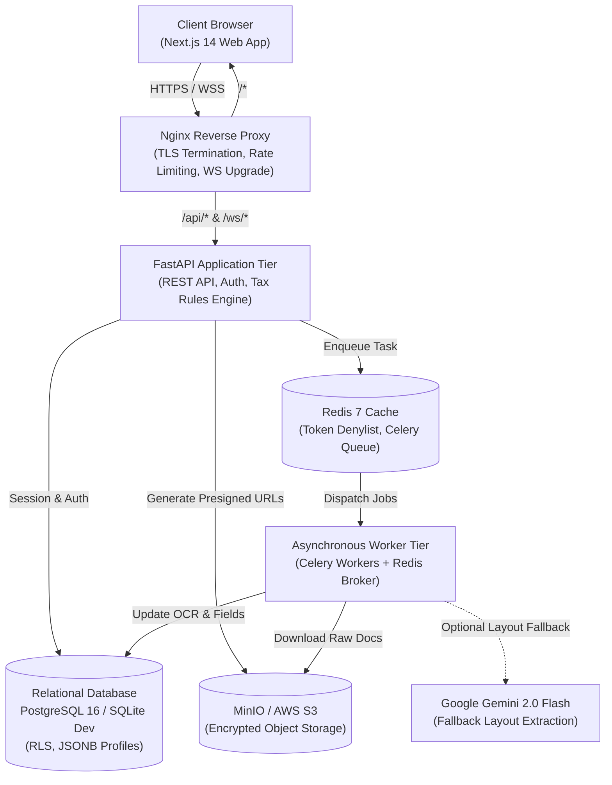
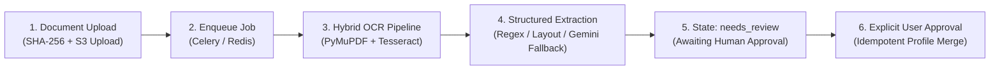
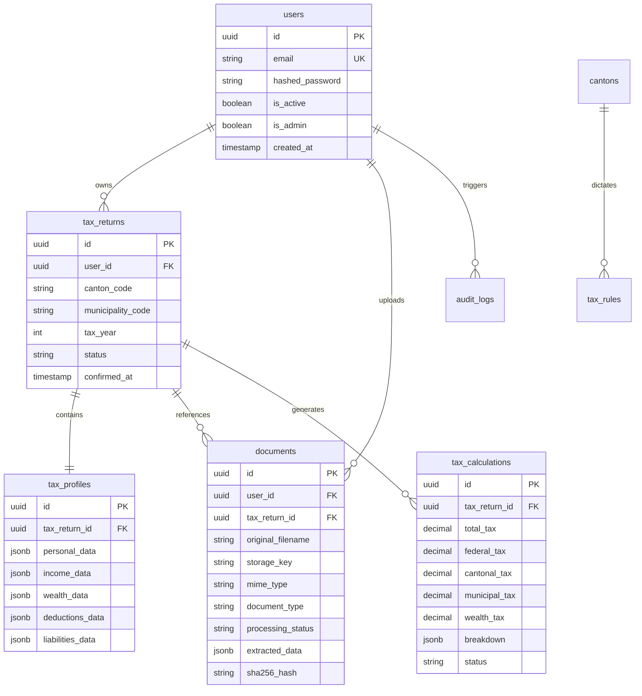

# SunTax System Architecture Specification

**Project**: SunTax – Web-Based Document-to-Tax-Return Platform  
**Document Version**: 1.2.0  
**Status**: Approved & Implemented  
**Date**: October 2026  
**Audience**: Technical Stakeholders, Lead Engineers, Security Auditors  

---

## 1. Executive Summary

SunTax is an intelligent, privacy-first web application designed to streamline the preparation of Swiss tax returns from raw taxpayer documentation. The system ingests scanned PDFs, digital documents, and smartphone photos, extracts structured financial and personal data via a hybrid OCR pipeline, allows human review of all extracted values, and deterministically calculates federal, cantonal, and municipal taxes across Swiss cantons.

### Core Architectural Directives
1. **Zero-LLM Tax Calculations**: Tax calculations are 100% deterministic and rule-driven. LLMs are never used for arithmetic or tax liability assessments.
2. **Human-in-the-Loop Integrity**: OCR extractions enter a strict `needs_review` state. Extracted values are never merged into a taxpayer's return profile without explicit user approval.
3. **Strict Tenant Isolation**: User data, tax returns, and uploaded documents are strictly segregated using Row-Level Security (RLS) and cryptographic access verification.
4. **Draft-Only Compliance**: The system outputs "Draft Structured Tax Data XML" (eCH-0196 compatible) and "Tax Return Summary PDF", making no false claims of official automated filing with cantonal authorities.

---

## 2. High-Level System Architecture

SunTax implements a decoupled **Three-Tier Web Architecture** paired with an **Asynchronous Distributed Worker Tier** for compute-heavy optical character recognition and document parsing.

---

## 3. Tier-by-Tier Specification

### 3.1 Presentation Tier (Next.js 14 Frontend)
* **Framework**: Next.js 14 (App Router architecture with React Server Components and Client Components).
* **Language & Typing**: TypeScript 5+ in strict mode.
* **Component System**: Tailwind CSS 3.4 + shadcn/ui built on unstyled accessible Radix primitives.
* **State & Data Synchronization**:
  * TanStack Query (React Query v5) for cache invalidation, background synchronization, and optimistic UI updates.
  * React Hook Form with Zod runtime schema validation for forms.
  * Real-time document processing updates via WebSocket (`/ws/{tax_return_id}`) with fallback to HTTP polling.
* **Key User Journeys**:
  * **Authentication**: Login, Registration with password strength meter, email verification, password reset.
  * **Tax Return Wizard**: Canton selection with visual heraldic emblems, searchable BFS municipality selection, and tax year selection (2025/2026).
  * **Document Ingestion & OCR Review**: Drag-and-drop file upload (PDF, JPEG, PNG, WebP, TIFF, HEIC), file-level status badges, field-by-field review screen showing confidence metrics and manual override controls.
  * **Calculation & Export**: Dynamic tax liability breakdown by authority (Federal, Canton, Municipality, Wealth), Summary PDF preview, and draft XML download.

---

### 3.2 Application Tier (FastAPI Backend)
* **Runtime**: Python 3.12 running on Uvicorn ASGI with native asynchronous event loops.
* **Input Validation**: Pydantic v2 schemas providing strict compile-time and runtime validation.
* **Modular Router Breakdown**:
  * `/api/v1/auth`: JWT issuance (HS256/RS256), refresh token rotation, user registration, email verification triggers.
  * `/api/v1/tax-returns`: Return lifecycle (draft → review → confirmed), Canton metadata and BFS municipality lookup.
  * `/api/v1/documents`: Multipart uploads, magic-byte inspection, SHA-256 duplicate detection, presigned download URLs, OCR retry triggers.
  * `/api/v1/tax-engine`: Deterministic calculation triggers, rule line-item explanations, WeasyPrint PDF compilation, and eCH-0196 XML generation.
  * `/api/v1/admin`: Administrative metrics, account status management, audit log inspection.

---

### 3.3 Asynchronous Processing & OCR Tier
Heavy document processing is completely decoupled from the synchronous HTTP request loop to preserve sub-100ms API response times.

1. **Format Handling**: Supports PDF, JPG, PNG, WebP, multi-page TIFF, and HEIC (where decoder is available).
2. **Hybrid OCR Engine (`app/services/ocr_service.py`)**:
   * **Digital PDF Layer**: Direct vector text extraction via PyMuPDF (fitz) for fast, 100% accurate extraction on digital PDFs.
   * **Scanned/Hybrid PDF Layer**: Pages with low text density (<40 characters) are rasterized at 300 DPI.
   * **Image Preprocessing**: Auto-rotates using Tesseract Orientation & Script Detection (OSD) for 90°, 180°, and 270° orientations; deskews tilt angles using projection-profile variance; enhances contrast via PIL autocontrast.
   * **Process Sandboxing**: Pytesseract processes run with strict execution timeouts; any subprocess exceeding `OCR_TIMEOUT_SECONDS` is actively terminated via `SIGKILL` to prevent resource starvation.
3. **Structured Data Extractor (`app/services/document_extractor.py`)**:
   * Classifies documents into 14 supported tax categories (Salary Certificate, Bank Statement, Securities Statement, Pillar 3a, Mortgage, Insurance, Donations, Medical, etc.).
   * Extracts fields deterministically using tailored Swiss number parsers (`120'000.00` / `120 000,00`).
   * Fallback to Google Gemini 2.0 Flash structured JSON schema when enabled and necessary for complex unformatted documents.
4. **Idempotent Merge Service (`app/services/document_pipeline_service.py`)**:
   * Tracks prior contributions per document ID.
   * Subtracts existing values before applying newly approved fields, preventing double-counting if a document is re-processed or reviewed multiple times.

---

### 3.4 Deterministic Swiss Tax Calculation Engine
* **Location**: `app/services/tax_engine_service.py`
* **Architecture**: Rule-based progressive calculation pipeline matching official Federal (ESTV) and Cantonal tax laws.

$$\text{Total Tax Liability} = \text{Federal Income Tax} + \text{Cantonal Income Tax} + \text{Municipal Income Tax} + \text{Wealth Tax}$$

1. **Taxable Income Calculation**:
   * Gross Employment Income (Lohnausweis line 8 or approved override).
   * Less Employment Deductions: Commuting (capped at Federal CHF 3'000 / Cantonal limits), Meals (CHF 3'200 standard), and Professional Equipment flat rates.
   * Less Pension & Savings: Pillar 3a contributions (strictly capped at CHF 7'258 for employed, CHF 36'288 for self-employed).
   * Less General Deductions: Health insurance premiums (single/married/child caps), medical expenses (exceeding 5% net income threshold), charitable donations (capped at 20% net income), and debt interest.
2. **Federal Tax Computation**:
   * Progressive bracket table application with marriage divisor/splitting methodology.
3. **Cantonal Tax Computation**:
   * Base tax evaluated using Canton-specific rate tables (e.g. Zürich, Bern, Zug, Schwyz).
4. **Municipal Tax Computation**:
   * Computed deterministically via: $\text{Cantonal Base Tax} \times \frac{\text{Municipality Multiplier}}{100}$.
5. **Wealth Tax Computation**:
   * Net wealth (bank deposits + securities tax values + real estate - liabilities - social deductions) evaluated against progressive cantonal wealth tax brackets.

---

## 4. Data & Storage Layer

### Storage Engines
* **Relational Storage**:
  * **Production**: PostgreSQL 16 with native `JSONB` indexing, foreign keys, and Row-Level Security policies.
  * **Development**: SQLite (`sqlite+aiosqlite`) at `backend/suntax_dev.db` enabling instantaneous local onboarding.
  * **Testing**: Isolated in-memory/temporary SQLite (`/tmp/suntax_isolated_test.db`) strictly isolated from dev data.
* **Cache & Transient Store**: Redis 7 managing JWT invalidation lists, Celery task distribution, and API request throttling counters.
* **Object Storage**: MinIO (development/staging) or AWS S3 (production) using tenant-segregated directory structures (`users/{user_id}/{doc_id}/filename.pdf`).

---

## 5. Security & Isolation Architecture

| Layer | Mechanism | Specification |
|---|---|---|
| **Identity & Access** | JWT Authentication | RS256/HS256 signed access tokens (15–60 min TTL) with refresh token rotation and Redis denylist on logout. |
| **Password Storage** | Bcrypt | Passlib bcrypt with salt cost factor 12. |
| **Tenant Isolation** | Foreign Key & RLS | Every record is bounded to `user_id`. API endpoints verify user identity prior to database execution. |
| **File Protection** | Sandboxing & Inspection | Magic-byte file validation, 50MB upload limits, password-protected PDF rejection, and isolated temporary disk storage. |
| **Transport Security** | TLS & Headers | TLS 1.3, Strict-Transport-Security (HSTS), X-Content-Type-Options, Content-Security-Policy (CSP), and X-Frame-Options: DENY. |
| **Audit Trails** | Immutability | `audit_logs` record all authentication, export, and financial modifications with IP and timestamp metadata. |

---

## 6. Deployment & Infrastructure

The entire platform is deployable via containerized orchestration:

* **Production Orchestration**: `docker-compose.prod.yml` defining separate microservices for Frontend, Backend, Celery Worker, PostgreSQL, Redis, and MinIO behind an Nginx reverse proxy.
* **Local Development**: Standalone shell scripts (`backend/start_dev.sh`) and hot-reloading Next.js dev server.
* **Continuous Integration**: GitHub Actions CI (`.github/workflows/ci.yml`) enforcing automated linting, security scanning with Bandit, and 100% passing tests on all pull requests.

---

## 7. Automated Test & Verification Matrix

The architecture is accompanied by an automated pytest verification suite ensuring reliability across all components:

* **E2E Document Pipeline Tests** (`tests/test_document_pipeline_e2e.py`): 21 tests verifying clean digital PDFs, scanned PDFs, rotated phone images (90°/180°/270°), multi-page TIFFs, blank/corrupt/password-protected files, timeout enforcement, storage failure propagation, Celery retries, and idempotent profile merging.
* **Tax Engine Tests** (`tests/test_tax_engine.py`): 16 tests verifying single vs. married splitting, progressive brackets across cantons, deduction caps, and total tax calculations against ESTV reference values.
* **Security & Isolation Tests** (`tests/security/test_user_isolation.py`): Verifying that tenant data access attempts by unauthenticated or unauthorized users are strictly denied.
